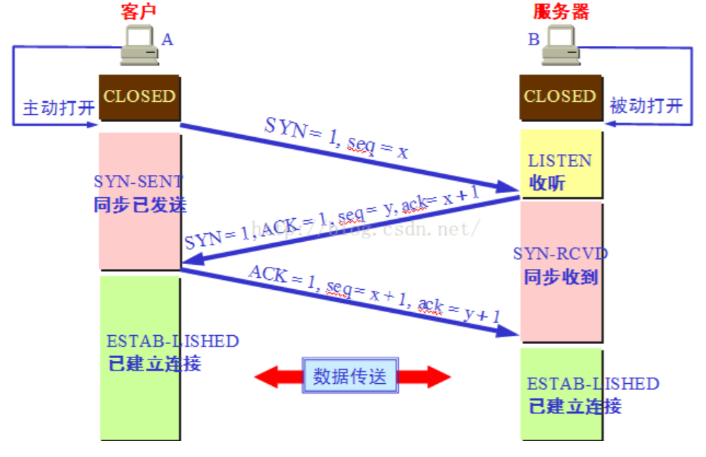
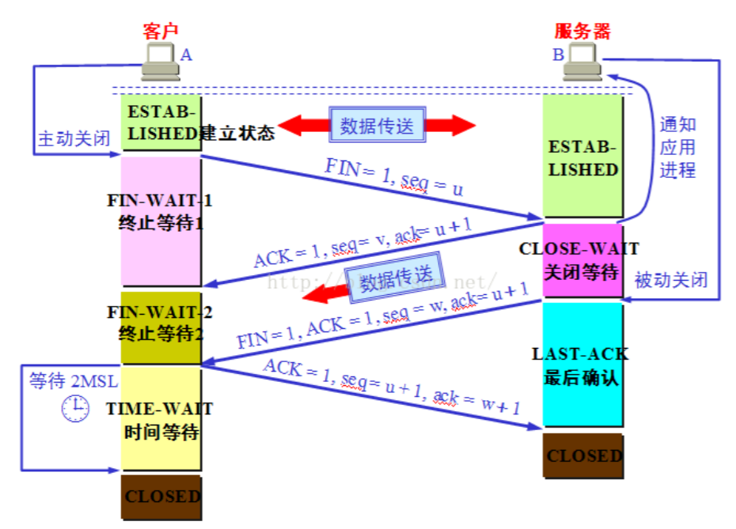

控制位说明：

ACK：1表示确认号有效；0表示报文中不包含确认信息，忽略确认号字段。

SYN：同步序号，1表示连接请求，用于建立连接和是顺序号同步。

FIN：用于释放连接，1表示发送方已经没有数据发送了，即关闭本方数据流。

#### 三次握手

第一次握手：主机A发送位码为SYN＝1,随机产生seq=1234567的数据包到服务器，主机B由 SYN=1 知道，A 要求建立联机；

第二次握手：主机B收到请求后要确认联机信息，向A发送ack=(主 机A的seq+1),syn=1,ACK=1,随机产生 seq=7654321的包

第三次握手：主机A收到后检查ack是否正确，即第一次发送的seq+1,以及位码ACK是否为1，若正确，主机A会再发送ack=(主机B的seq+1)，seq=(主机A第一次发送的seq+1)，ACK=1，主机B收到后确认seq值与 ACK=1则连接建立成功。

#### 四次挥手

TCP 建立连接要进行三次握手，而断开连接要进行四次。这是由于 TCP 的半关闭造成的。因为 TCP 连
接是全双工的(即数据可在两个方向上同时传递)所以进行关闭时每个方向上都要单独进行关闭。这个单
方向的关闭就叫半关闭。当一方完成它的数据发送任务，就发送一个 FIN 来向另一方通告将要终止这个
方向的连接。
1） 关闭客户端到服务器的连接：首先客户端 A 发送一个 FIN，用来关闭客户到服务器的数据传送，
然后等待服务器的确认。其中终止标志位 FIN=1，序列号 seq=u
2） 服务器收到这个 FIN，它发回一个 ACK，确认号 ack 为收到的序号加 1。
3） 关闭服务器到客户端的连接：也是发送一个 FIN 给客户端。
4） 客户段收到 FIN 后，并发回一个 ACK 报文确认，并将确认序号 seq 设置为收到序号加 1。
首先进行关闭的一方将执行主动关闭，而另一方执行被动关闭。

**各状态含义**：

   1、CLOSED:没有任何连接状态

   2、LISTEN：监听状态，等待来自远方TCP端口的连接请求

   3、SYN-SENT：在发送连接请求后，等待对方确认

   4、SYN-RECEIVED：在收到和发送一个连接请求后，等待对方确认

   5、ESTABLISHED：传输连接建立，双方进入数据传送状态

   6、FIN-WAIT-1：主动关闭，主机已发送关闭连接请求，等待对方确认

   7、FIN-WAIT-2：主动关闭，主机已收到对方关闭传输连接确认，等待对方发送关闭传输连接请求

   8、TIME-WAIT：完成双向传输连接关闭，等待所有分组消失

   9、CLOSE-WAIT：被动关闭，收到对方发来的关闭连接请求，并已确认

  10、LAST-ACK：被动关闭，等待最后一个关闭传输连接确认，并等待所有分组消失

  11、CLOSING：双方同时尝试关闭传输连接，等待对方确认（这种状态在上图中并没有显示出来，但偶尔还是会有这种状态出现的）

**两个小问题**

1.为什么连接的时候是三次握手，关闭的时候却是四次握手？
     答：因为当服务器端收到客户端的SYN连接请求报文后，可以直接发送SYN+ACK报文。其中ACK报文是用来应答的，SYN报文是用来同步的。但是关闭连接时，当服务器端收到FIN报文时，很可能并不会立即关闭端口，所以只能先回复一个ACK报文，告诉客户端，“你发的FIN报文我收到了“。只有等到我服务器端这边所有的报文都发送完了，我才能发送FIN报文，不能应答和报文一起发送。就像我们双方通话时，一人说要挂电话，他也会等到对方讲话结束，并且对方也同意结束通话是一个道理。

2.为什么TIME_WAIT状态需要经过2MSL(最大报文段生存时间)才能返回到CLOSE状态？

​     答：按道理，四个报文都发送完毕，可以直接进入CLOSE状态，但是我们要知道，网络在传输数据的过程中也有不稳定的时候，网络拥挤、堵塞，这都是极有可能发生的事情。这些情况出现的话，最后一个ACK就有可能丢失。所以TIME_WAIT状态就是用来重发可能丢失的ACK报文。