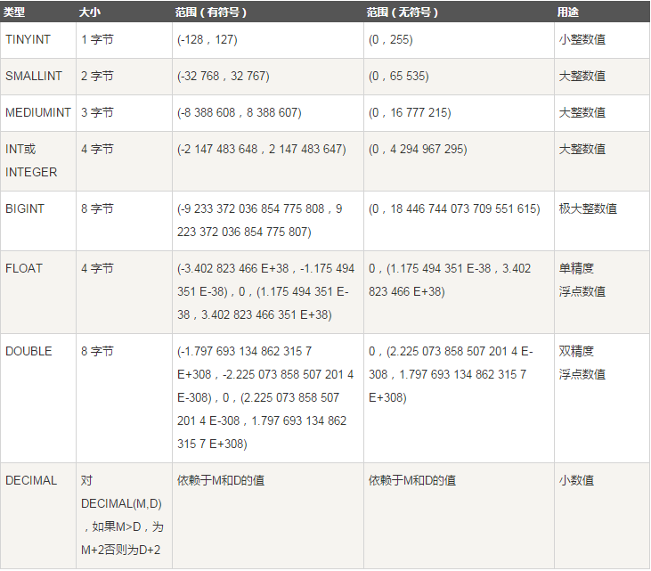

#### 1.连接MySQL

格式： mysql -h主机地址 -u用户名 －p用户密码

---

#### 2.存储过程

```sql
-- 基本格式
create procedure proc_name(proc_params)
begin
	proc_body;
end
```

**参数**

in：输入参数，可以传入字面量或者变量。

out：返回参数，只能是变量。

inout：输入输出参数，尽量少用。

**调用方式**

`call proc_name([params]);`

**变量声明**

```sql
DECLARE variable_name [,variable_name...] datatype [DEFAULT value];

DECLARE l_int int unsigned default 4000000;  
DECLARE l_numeric number(8,2) DEFAULT 9.95;  
DECLARE l_date date DEFAULT '1999-12-31';  
DECLARE l_datetime datetime DEFAULT '1999-12-31 23:59:59';  
DECLARE l_varchar varchar(255) DEFAULT 'This will not be padded';
```

**if-then-else语句**

```sql
CREATE PROCEDURE proc2(IN parameter int)  
begin 
declare var int;  
set var=parameter+1;  
if var=0 then 
insert into t values(17);  
end if;  
if parameter=0 then 
update t set s1=s1+1;  
else 
update t set s1=s1+2;  
end if;  
end;  
```

**case语句**

```sql
CREATE PROCEDURE proc3 (in parameter int)  
begin 
declare var int;  
set var=parameter+1;  
case var  
when 0 then   
insert into t values(17);  
when 1 then   
insert into t values(18);  
else   
insert into t values(19);  
end case;  
end;  

-- 格式
case
    when var=0 then
        insert into t values(30);
    when var>0 then
    when var<0 then
    else
end case
```

**循环语句**

1. while ··· end while

```sql
CREATE PROCEDURE proc4()  
begin 
declare var int;  
set var=0;  
while var<6 do  
insert into t values(var);  
set var=var+1;  
end while;  
end;  

-- 格式
while 条件 do
    --循环体
end while
```

2. repeat ··· end repeat

```sql
CREATE PROCEDURE proc5 ()  
begin   
declare v int;  
set v=0;  
repeat  
insert into t values(v);  
set v=v+1;  
until v>=5  
end repeat;  
end;

-- 格式
repeat
    --循环体
until 循环条件  
end repeat;
mysql > DELIMITER ;
```

3. loop ··· end loop

```sql
CREATE PROCEDURE proc6 ()  
begin 
declare v int;  
set v=0;  
LOOP_LABLE:loop  
insert into t values(v);  
set v=v+1;  
if v >=5 then 
leave LOOP_LABLE;  
end if;  
end loop;  
end;   
```
一个例子
```sql
CREATE PROCEDURE proc_list(in tableName varchar(100), in startTime varchar(20))
begin 
	declare m_sql LONGTEXT;
	set m_sql = 'select * from tableName where sex != \'0\' and updateTime >= startTime';
	set m_sql = replace(m_sql,'tableName',tableName);
	set m_sql = replace(m_sql,'startTime',concat('\'',startTime,'\''));
	-- select m_sql;
	set @m_sql = m_sql;
	prepare s1 from @m_sql;
	EXECUTE s1;
	DEALLOCATE prepare s1;
end
```
---

#### 3.函数

**`date_format`**

```sql
select date_format(now(),'%Y-%m-%d %T');
select date_format(now(),'%Y-%m-%d %H:%i:%s');
```

**`sub_str`**

```sql
select substr('2019-06-23 23:59:59' from 1 for 10);
select concat(substr('2019-06-23 23:59:59',1,10),',',substr('2019-06-23 23:59:59',12,8));
```


---

#### 4.`alter`命令

1.改表格的列的名称和属性

alter table [表名] change [旧列名] [新列名] 属性。

```sql
alter table user change name user_name varchar(50) default null; 
```

2.修改表名

命令：rename table 原表名 to 新表名;
alter table 原表名 rename to/as 新表名

3.增加字段

命令：alter table 表名 add 字段 类型 其他;

```sql
-- 例如：在表MyClass中添加了一个字段passtest，类型为int(4)，默认值为0
alter table MyClass add passtest int(4) default '0'
```

4.加索引
   mysql> alter table 表名 add index 索引名 (字段名1[，字段名2 …]);

```sql
alter table employee add index emp_name (name);
```

5.加主关键字的索引
  mysql> alter table 表名 add primary key (字段名);

```sql
alter table employee add primary key(id);
```

6.加唯一限制条件的索引
   mysql> alter table 表名 add unique 索引名 (字段名);

```sql
alter table employee add unique emp_name2(cardnumber);
```

7.删除某个索引
   mysql> alter table 表名 drop index 索引名;

```sql
alter table employee drop index emp_name;
```

8.删除字段
ALTER TABLE table_name DROP field_name;

9.加备注
表：
alter table table_name comment '注释';
字段：
alter table table_name modify column field_name type comment '注释';

#### 修改密码

格式：mysqladmin -u用户名 -p旧密码 password 新密码

  

#### 5.join 匹配原理

https://www.cnblogs.com/LQBlog/p/10711743.html

1.默认将小表作为驱动表

2.如果小表有索引而大表没索引，则以大表作为驱动表

3.left join强制将左边的表作为驱动表

优化原则：

* 尽量减少驱动表条数 非驱动表关联条件建立索引

* 虽然大部分会经过mysql优化器自动优化,复杂sql最好通过执行计划查看一下 是否有性能瓶颈

* 注意不要通过left join 影响sql优化器 将大表作为驱动表

* 记住join 索引只有在非驱动表上面才能体现作用


#### 6.执行计划
https://www.cnblogs.com/LQBlog/p/10723158.html

`id`

执行顺序,值越大的优先执行,如果相同则按顺序执行

`select_type`

1、**simple**：简单的select查询，查询中不包含子查询或者union 
2、**primary**：查询中包含任何复杂的子部分，最外层查询则被标记为primary 
3、**subquery**：在select 或 where列表中包含了子查询 
4、**derived**：在from列表中包含的子查询被标记为derived（衍生），mysql或递归执行这些子查询，把结果放在零时表里 
5、**union**：若第二个select出现在union之后，则被标记为union；若union包含在from子句的子查询中，外层select将被标记为derived 
6、**union result**：从union表获取结果的select

`type`

查询的指标 结果从优劣从优到劣排序为

*system* > *const* > *eq_ref* > *ref* > *fulltext* > *ref_or_null* > *index_merge* > *unique_subquery* > *index_subquery* > *range* > `index` > *ALL*

**一般来说，好的sql查询至少达到range级别，最好能达到ref**

1、system

const的特例平时无法重现 可以忽略 

2、const

表示通过扫描索引，扫描一行就找到了数据，const用于比较primary key 或者 unique索引。因为只需匹配一行数据，所有很快。如果将主键置于where列表中，mysql就能将该查询转换为一个const 

3、eq_ref

非驱动表关联字段为主键或者唯一索引查找时，

如果where条件中查询非驱动表为非唯一索引或者主键索引则会降为ref

4、ref

非驱动表关联字段为非唯一索引

5、range

表示范围查询 常见于between 和>, >=,<, <= 前提是字段有建立btree索引

6、index

与ALL类似 只是index全表扫描扫描的是索引页而不是数据行，

如果id做了索引，只需要去索引页里面取出所有id数据就好了

7、all

全表扫描

`possible_keys`

指出MySQL能使用哪个索引在表中找到行，查询涉及到的字段上若存在索引，则该索引将被列出，但不一定被查询使用

`key`

实际使用的索引，如果为NULL，则没有使用索引

`key_len`

表示索引中使用的字节数，查询中使用的索引的长度（最大可能长度），并非实际使用长度，理论上长度越短越好。key_len是根据表定义计算而得的，不是通过表内检索出的

`ref`

显示索引的那一列被使用了，如果可能，是一个常量const。

`rows`

根据表统计信息及索引选用情况，大致估算出找到所需的记录所需要读取的行数

`extra`

包含不适合在其他列中显示但十分重要的额外信息

1、Using index :

表示使用了覆盖索引,覆盖索引:表示索引包含了返回和查询的所有列 而不需要读取文件

2、Using where:

Using where的作用只是提醒我们MySQL将用where子句来过滤结果集

3、Using temporary

表示mysql需要临时表转存数据 常见于 group by使用非索引字段

4、Using filesort

表示使用了非索引字段排序


#### 开启慢查询日志

1.查看mysql是否开启mansql记录日志

show variables like 'slow_query_log';

2.慢sql记录时间

show variables like 'long_query_time';

3.设置记录mysql为打开状态

```
set global slow_query_log='ON';OFF为关闭
设置超过一秒的sql都将记录
set global long_query_time=1
```

设置记录文件

set global slow_query_log_file='/var/lib/mysql/test_1116.log';

查看记录文件

show variables like 'slow_query_log_file';


#### 7.grant的使用

1.创建用户

create user test identified by '12345';

2.赋予用户configdb数据库上的select\insert\delete\update权限

mysql>grant select,insert,delete,update on configdb.* to 'test'@'%';

3.execute权限

grant execute on configdb.* to 'test'@'%;

4.显示用户拥有的权限

show grants for test;

#### *[int(M)和tinyint(M)数值类型中M值的意义](https://www.cnblogs.com/totian/p/7065123.html)

1、整数型的数值类型已经限制了取值范围，有符号整型和无符号整型都有，而M值并不代表可以存储的数值字符长度，它代表的是数据在显示时显示的最小长度；

2、当存储的字符长度超过M值时，没有任何的影响，只要不超过数值类型限制的范围；

3、当存储的字符长度小于M值时，只有在设置了zerofill用0来填充，才能够看到效果，换句话就是说，没有zerofill，M值就是无用的。

总结：int(11)，tinyint(1)，bigint(20)，后面的数字，不代表占用空间容量。而代表最小显示位数。这个东西基本没有意义，除非你对字段指定zerofill。



##### *让查询强制走索引
select * from 表名 force index(索引名)

##### *有索引未使用到的情况：
1.查询的数据量占数据总量很大的比例
2.针对两个表通过某个字符列关联，有可能是该列的排序规则不同
3.优化器任务使用索引对查询速度的提升并不多，所以不走索引